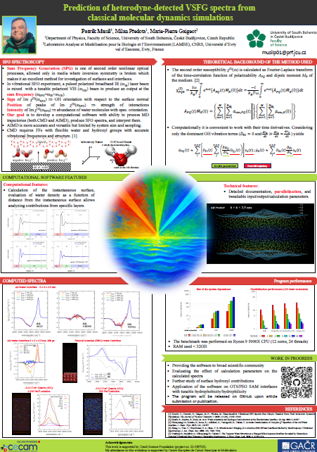

# SFG_Tools
This repository stores tools for processing MD trajectories to obtain SFG spectra. The code will be uploaded after submission/publication of the article related to those tools. [TODO: link for published work]

You probably landed on this page due to QR code in the .
