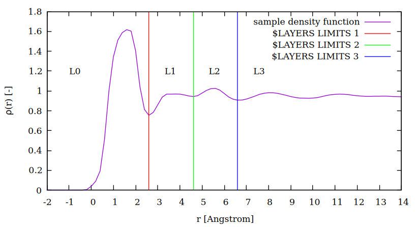
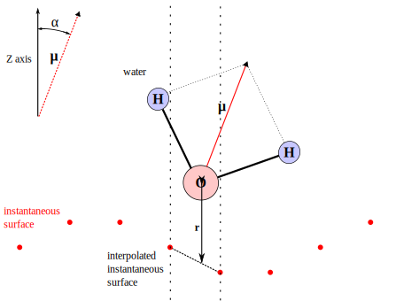
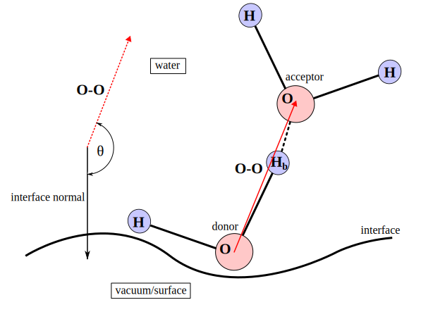
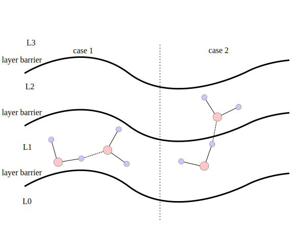

# Binder
The main function of this program is to create a file called [binder.bin](../user_guide/files.md/#binderbin), which labels all the water molecules in each time step with number 0 to 15 according to the position of the molecule relative to the interface (see table below)

| layer number | meaning |
| --- | --- |
| 0 | bottom L0 |
| 1 | bottom L1 |
| 2 | bottom L2 |
| 3 | bottom L3 |
| 4 | bottom L4 |
| 5 | bottom L5 |
| 6 | bottom L6 |
| 7 | bottom L7 |
| 8 | upper L0 |
| 9 | upper L1 |
| 10 | upper L2 |
| 11 | upper L3 |
| 12 | upper L4 |
| 13 | upper L5 |
| 14 | upper L6 |
| 15 | upper L7 |

, hence [$LAYERS_LIMITS](../user_guide/files.md/#table-of-all-boxdata-file-parameters) (see figure below) needs to be written by user to [the BOXDATA file](../user_guide/files.md/#input-boxdata-file) before the program is called. Up to 7 numbers can be put in to distinguish between the 8 respective layers.

Additional analysis features are described in the subsections [Dipole analysis](#dipole-analysis), and [Hydrogen bond distributions](#hydrogen-bond-distributions).

## Dipole analysis
The program allows calculation of average dipole orientation ($\cos(\alpha)$) of water molecules as a function of distance from the [instantaneous surface](../programs_description/Interface.md/#calculation-of-instantaneous-surface). The distance is measured from an interpolated point of the [instantaneous surface](../programs_description/Interface.md/#calculation-of-instantaneous-surface) based on the X-Y position of the molecule. Range and fineness of the calculation can be adjusted by setting [$DIPOLE_R_START](../user_guide/files.md/#table-of-all-boxdata-file-parameters), [$DIPOLE_R_END](../user_guide/files.md/#table-of-all-boxdata-file-parameters), and [$DIPOLE_BINWIDTH](../user_guide/files.md/#table-of-all-boxdata-file-parameters) parameters in [the BOXDATA file](../user_guide/files.md/#input-boxdata-file).

## Hydrogen bond distributions
Yet another function of this program is to create [3D histograms](../user_guide/files.md/#histogram_3dhist-optional) for hydrogen bond distribution/orientation, such as *X* axis describes O(-H) $\cdots$ O distance, *Y* axis describes $\cos(\theta)$ (see figure below), and *Z* axis describes probability of occurrence. Range and number of divisions of *X* and *Y* axes can be adjusted by [$HBHIST_DIST_START](../user_guide/files.md/#table-of-all-boxdata-file-parameters), [$HBHIST_DIST_END](../user_guide/files.md/#table-of-all-boxdata-file-parameters), [$HBHIST_DIST_DIV](../user_guide/files.md/#table-of-all-boxdata-file-parameters), [$HBHIST_ANGLE_START](../user_guide/files.md/#table-of-all-boxdata-file-parameters), [$HBHIST_ANGLE_END](../user_guide/files.md/#table-of-all-boxdata-file-parameters), and [$HBHIST_ANGLE_DIV](../user_guide/files.md/#table-of-all-boxdata-file-parameters) parameters.

Definition of the hydrogen bond was adopted from White et al.[^1]; Molecular conformation fulfilling: O(-H) $\cdots$ O distance $\leq$ 3.2 &#197;, and the O-H $\cdots$ O angle in range 140-180 degrees, is considered as hydrogen bond.

> [!NOTE]
> Interface normal allways points from the water bulk towards the vacuum/surface.

[3D histogram files](../user_guide/files.md/#histogram_3dhist-optional) have 3 columns of *Z* data (see table below). The three columns is a triplet of data: interlayer, intralayer, and total interactions. All the columns of *Z* data are normalized so their sum is equal to 1.

counting rules:

| case 1 | case 2 |
| --- | --- |
| Intra-layer contribution | Inter-layer contribution |
| L1 intra +1 | L1 inter +1 |

## Input and output file table

| input files | output files |
| --- | --- |
| [BOXDATA](../user_guide/files.md/#input-boxdata-file) | [binder.bin](../user_guide/files.md/#binderbin) |
| [simulation trajectory](../user_guide/files.md/#input-trajectory-files) | [hbonds.dat](../user_guide/files.md/#hbondsdat-optional) (optional) |
| [interface.xyz](../user_guide/files.md/#interfacexyz-optional) (optional) | [dipole.dat](../user_guide/files.md/#dipoledat-optional) (optional) |
|     | [Histogram_*.3dhist](../user_guide/files.md/#histogram_3dhist-optional) (optional) |

[^1]: White, J. A.; Schwegler, E.; Galli, G.; Gygi, F. The Solvation of Na+ in Water: First-Principles Simulations. J. Chem. Phys. *2000*, 113, 4668−4673.
