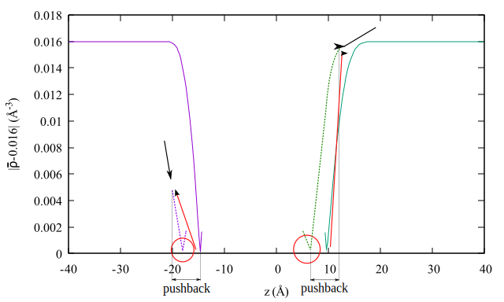
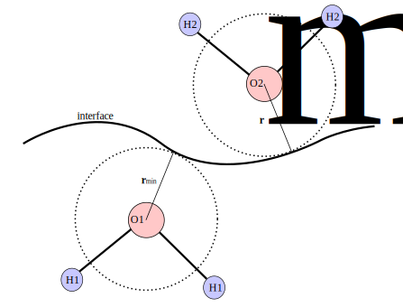

# Interface
Calculates instantaneous surface of the water and water molecule density dependent on the distance from the instantaneous surface.

## Calculation of instantaneous surfaces
The instantanous surface of water molecules is calculated using coarse-grained density according to Willard and Chandler[^1]

```math		
\bar{\rho}(\vec{r},t) = \sum_i \phi(|\vec{r}-\vec{r}_i(t)|;\xi)
```

```math
\phi(\vec{r};\xi) = \frac{\exp\left( - \frac{|\vec{r}|^2}{2 \xi^2} \right)}{(2\pi\xi^2)^{3/2}}
```

Where $\vec{r}_i(t)$ is position of i-th oxygen in the system, coarse graining length $\xi = 2.4$ &#197;, which is approximately equal to the molecular diameter of liquid water. Instantaneous surface are then points in space, which satisfy the condition $\bar{\rho} = 0.01668$ &#197; $^{-3}$, which is approximately half the bulk density of water (half of the bulk density is set as default, the exact ratio of the bulk density can be set by parameter [$INTERFACE_DENSITY](../user_guide/files.md/#table-of-all-boxdata-file-parameters) in [BOXDATA file](../user_guide/files.md/#input_boxdata_file)). Volume of the simulation box is equidistantly discretized in each direction, roughness of the space division can be adjusted by setting [$INTERFACE_VOLUME_ELEMENT](../user_guide/files.md/#table-of-all-boxdata-file-parameters) in [BOXDATA file](../user_guide/files.md/#input_boxdata_file), therefore points that are the closest to the $\bar{\rho} = 0.01668$ are selected by searching the first positive derivative of $|\bar{\rho} = 0.01668|$ in each discretized *Z* position from both sides of the simulation box. The search mechanism can be seen in the figure below.


This method, however, would be very slow, due to the need to calculate $\bar{\rho}$ even in areas where no water is present. Since the simulation steps for SFG-spectra calculations are usually small (around 0.4 fs) to really record OH stretch movements, one can say that the instantaneous surface from one step to another does not change significantly and:

1. The instantaneous surface does not need to be evaluated in each timestep.
    - This can be achieved by setting [$INTERFACE_SKIP](../user_guide/files.md/#table-of-all-boxdata-file-parameters) in [BOXDATA file](../user_guide/files.md/#input-boxdata-file) (number of frames to be skipped while evaluating the instantaneous surfaces) to a number greater than 0.

2. Areas with no water can be skipped in calculation of i-th interface where i > 1.
    - Searching for the surface point in time $t$ with fixed *X* and *Y* coordinates starts from the surface point in the same *X* and *Y* coordinates from the surface point calculated in the time $t-1$, but with some pushback in *Z* direction (see figure below). This can be achieved by setting [$INTERFACE_PUSHBACK](../user_guide/files.md/#table-of-all-boxdata-file-parameters) in [BOXDATA file](../user_guide/files.md/#input-boxdata-file) to a positive non zero value.



## Calculation of density function
To further assign water molecules into interfacial layers, calculation of density profile as a function of distance of the water molecules to the water interface needs to be done. The distance is measured from an interpolated point of the interface based on the X-Y position of the molecule.



The density function is then calculated:

```math
\rho(r)=\frac{N_{bin}}{V_{bin} \cdot n_{step} \cdot 1000}
```

Where $N_{bin}$ is the number of molecules belonging to a bin centered at $r$ ($r$ ranges from [$DENSITY_MIN_R](../user_guide/files.md/#table-of-all-boxdata-file-parameters) to [$DENSITY_MAX_R](../user_guide/files.md/#table-of-all-boxdata-file-parameters) with a step $`\frac{1}{\text{\$DENSITY\_BIN}}`$ which can be set in the [BOXDATA file](../user_guide/files.md/#table-of-all-boxdata-file-parameters)). Height of the bin is $2 \cdot$ [$DENSITY_TOL](../user_guide/files.md/#table-of-all-boxdata-file-parameters) (from $r - $ [$DENSITY_TOL](../user_guide/files.md/#table-of-all-boxdata-file-parameters) to $r + $ [$DENSITY_TOL](../user_guide/files.md/#table-of-all-boxdata-file-parameters)). Bins are filled with data through all [$NSTEP](../user_guide/files.md/#table-of-all-boxdata-file-parameters) steps ($n_{step}$) of the input trajectory file. $V_{bin}$ is volume of the bin (box area in X-Y plane $\times 2 \cdot $ [$DENSITY_TOL](../user_guide/files.md/#table-of-all-boxdata-file-parameters). The density profile is then stored in file [density.dat](../user_guide/files.md/#table-of-all-boxdata-file-parameters). The number density in N/nm$^{-3}$ is reported.

Input and output file table


| input files | output files |
| ----------- | ------------ |
| [BOXDATA](../user_guide/files.md/#table-of-all-boxdata-file-parameters) | [interface.bin](../user_guide/files.md/#interfacebin) |
| [Simulation trajectory](../user_guide/files.md/#input-trajectory-files) | [grid_interface](../user_guide/files.md/#grid_interface) |
|     | [density.dat](../user_guide/files.md/#densitydat) |
|     | [interface.xyz](../user_guide/files.md/#interfacexyz-optional) (optional) |

[^1]: Adam P. Willard and David Chandler; The Journal of Physical Chemistry B *2010* 114 (5), 1954-1958; DOI: [10.1021/jp909219k](https://doi.org/10.1021/jp909219k)
