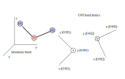
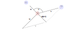
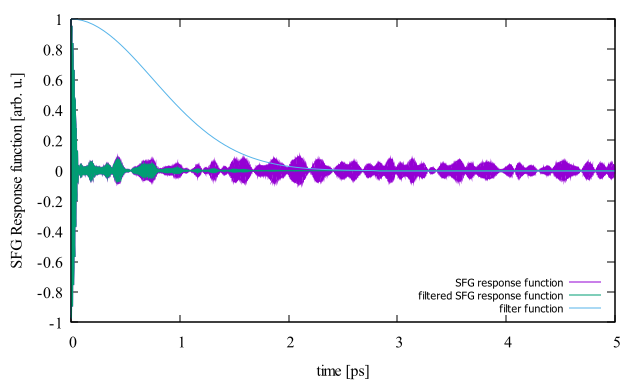

# SSP_CORR
This program calculates correlation function of $`\dot{A}_{xx}`$ and $`\dot{M}_{z}`$, it is needed to calculate the resonant part of $\chi^{(2),R}$ which is responsible for the $\chi^{(2)}$ dependency on $\omega_{IR}$ and is the central quantity for the analysis of SFG spectra.

Simple general equation to calculate the resonant part of $\chi^{(2),R}$ according to [^1]

```math
\chi_{PQR}^{(2),R}=\frac{i\omega}{k_B T}\int\limits_0^{+\infty}e^{i \omega t}\langle A_{PQ}(t)M_R(0)\rangle dt
```

where $\chi^{(2),R}$ is the resonant part of second-order susceptibility tensor, ($P, Q, R$) are any directions of the laboratory frame, $\omega$ is the frequency of IR beam, $A_{PQ}$ and $M_R$ are respectively the components of the total polarizability tensor and the total dipole moment (more exactly their instantaneous values with their average values subtracted – a necessary condition for the correlation function to decay to zero). The correlation function of the two properties separated by a time difference t is averaged over all available time origins to provide good statistics, i.e.,

```math
\langle A_{PQ}(t) M_R(0) \rangle = \langle A_{PQ}(t+\tau) M_R(\tau) \rangle _\tau
```

Khatib et al. [^2] later modified the equation for calculation of the second order susceptibility replacing the correlation function of dipole moment and polarizability by correlation function of the time derivatives of dipole moment and polarizability.

```math
\chi^{(2),R}_{PQR} = \frac{-i}{k_B T \omega} \int\limits_0^{+\infty} e^{i \omega t} \langle \dot{A}_{PQ}(t) \dot{M}_R(0) \rangle dt
```

While this modification theoretically stems from the rule that the Fourier transform of a derivative can be expressed as $n$ of $f'(t)$ is $i \omega F(\omega)$, it was introduced to simplify the numerical calculation of susceptibility, since the evaluation of time derivatives $`\dot{A}_{xx}`$ and $`\dot{M}_{z}`$ using the information on atomic velocities is computationally less demanding than calculating the properties themselves. Supposing that only O-H stretching of $M$ molecules with $N_m$ O-H bonds has impact on the final spectra in the region of interest, total polarizability, and dipole moment of the system ($A_{PQ}, M_R$) can be decomposed into individual O-H bond contributions.

```math
\dot{M}_R(t) = \sum\limits_{m=1}^{M} \sum\limits_{n=1}^{N_m} \dot{\mu}_{mn,R}(t)
```

```math
\dot{A}_{PQ}(t) = \sum\limits_{m=1}^{M} \sum\limits_{n=1}^{N_m} \dot{\alpha}_{mn,PQ}(t)
```

In addition, thanks to basic geometry considerations, the dipole moment contribution of OH bond can be projected from OH bond frame ($\mu_b$) to the laboratory frame ($\mu_l$):

```math
\mu_l = \mathbf{D} \mu_b
```

where $\mathbf{D}$ is the direction cosine matrix projecting the O-H bond frame into the laboratory frame.

In the following equations two assumptions are applied. The first assumption is that the bond elongations are small enough to make first order Taylor expansion. The second assumption is that the stretching mode of the bond is much faster than the modes involving a bond reorientation – for example the liberation. Meaning of the second assumption is that $\dot{D}_{Ri} \approx 0$ and that $\frac{dr_z}{dt} \gg \frac{dr_x}{dt} \approx \frac{dr_y}{dt}$ therefore $\dot{\mu}_r$ can be simplified into:

```math
\begin{split}
	\dot{\mu}_R(0) &
	\approx \sum^{x,y,z}_i D_{Ri}(t) \dot{\mu}_i(t) \\
	&
	\approx \sum^{x,y,z}_i D_{Ri}(t) \left( \sum^{x,y,z}_j \frac{d \mu_j}{dr_j} \frac{dr_j(t)}{dt} \right) \\
	&
	\approx \sum^{x,y,z}_i D_{Ri}(t) \frac{d\mu_i}{dr_z} v_z(t)
\end{split}
```

where $v_z(t) = \frac{dr_z(t)}{dt}$ corresponds to the projection of the velocity on the bond axis.

Similarly, formula for the polarizability derivative can be derived:

```math
\dot{\alpha}_{PQ}(t) \approx 
\sum^{x,y,z}_i \left[ D_{Pi}(t) \sum^{x,y,z}_j \left( 
\frac{d\alpha_{ij}}{dr_z} D_{Qj}(t) \right) \right] v_z(t)
```

Where projections of the velocities on the O-H bond axis $v_z$ and direction cosine matrices $\mathbf{D}$ can be evaluated from molecular dynamics trajectory, $\frac{d\mu_i}{dr_z}$ and $\frac{d\alpha_{ij}}{dr_z}$ can be parametrized [^2].

## Construction of D matrices and evaluation of vz
D matrices are constructed to rotate the space from laboratory frame to so called O-H bond frame. O-H bond frame has *Z* axis pointing in the direction $\overrightarrow{OH}$; *X* axis lies in the water molecule plane, the axis is facing away from the second hydrogen; *Y* axis is product of these two axes (*Z* $\times$ *X*). O-H bond frames are depicted in figure below.



To show the calculations behind construction of the D-matrix:

```math
\mathbf{D} = \begin{bmatrix} 
			a_{11} & a_{12} & a_{13} \\\
			a_{21} & a_{22} & a_{23} \\\
			a_{31} & a_{32} & a_{33}
\end{bmatrix}
```

Let the $`\vec{r}_{\text{O}}`$ , $`\vec{r}_{\text{H1}}`$ and $`\vec{r}_{\text{H2}}`$ vectors be position vectors of water molecule atoms in the laboratory frame, and consider construction of D-matrix of $\text{O-H}_1$ bond.

The $`\vec{a}_{*3}`$ vector in matrix **D** is unit vector pointing in the $\overrightarrow{OH_1}$ direction.

```math
\vec{a}_{*3} = \frac{\vec{r}_{\text{H1}}-\vec{r}_{\text{O}}} {|\vec{r}_{\text{H1}}-\vec{r}_{\text{O}}|}
```

To calculate the $`\vec{a}_{*1}`$ vector we assume $`\vec{u} = \vec{a}_{*3}`$ , $`\vec{v} = \vec{r}_{\text{H2}} - \vec{r}_{O}`$ . Since the vector $`\vec{u}`$ is a unit vector, we can get projection of vector $`\vec{v}`$ on the vector $`\vec{u}`$ multiplying $`\vec{u}(\vec{u} \cdot \vec{v}) = \vec{u} \cdot | \vec{u} | \cdot | \vec{v} | \cdot \cos(\varphi) = \vec{u} \cdot | \vec{v} | \cdot \cos(\varphi)`$. If we construct vector $`\vec{w} = \vec{u}(\vec{u} \cdot \vec{v}) - \vec{v}`$, it is perpendicular to vector $`\vec{u}`$ in the molecular plane (see figure below). Then the Vector $`\vec{a}_{*1}`$ is equal to $`\frac{\vec{w}}{|\vec{w}|}`$ ( $`-\frac{\vec{w}}{|\vec{w}|}`$.

```math
\textbf{a}_{*1} =
	\frac{\textbf{w}}{|\textbf{w}|} =
	\frac
	{\textbf{u}(\textbf{u} \cdot \textbf{v}) - \textbf{v}}
	{| \textbf{u}(\textbf{u} \cdot \textbf{v}) - \textbf{v} |}
```



Vector $`\vec{a}_{*2}`$ is simply a cross product of vectors $`\vec{a}_{*3}`$ and $`\vec{a}_{*1}`$.

```math
\vec{a}_{*2} = \vec{a}_{*3} \times \vec{a}_{*1}
```

Properties of the **D** matrix (**D** $^T$ = **D** $^{-1}$ ) allows us to easily transform vectors from O-H frame to the laboratory frame and vice versa.

## Calculation of the correlation function of Mz and Axx
Using equations for dipole moment and polarizability mentioned [here](./SSP_CORR.md/#ssp_corr) we can write:

```math
			\begin{split}
				\dot{A}_{PQ}(t)\dot{M}_{R}(0) &
				= \Biggl\{ \sum^{M}_{m=1} \sum^{N_m}_{n=1} \dot{\alpha}_{mn,PQ}(t) \Biggr\}
				\Biggl\{ \sum^{M}_{m'=1} \sum^{N_m'}_{n'=1} \dot{\mu}_{m'n',R}(0) \Biggr\} \\
				&
				= \Biggl\{ \sum^{M}_{m=1} \Biggl[ \sum^{N_m}_{n=1} \dot{\alpha}_{mn,PQ}(t) \Biggr] \Biggr\}
				\Biggl\{ \sum^{M}_{m'=1} \Biggl[ \sum^{N_m'}_{n'=1} \dot{\mu}_{m'n',R}(0) \Biggr] \Biggr\} \\
				&
				= \sum^{M}_{m=1} \sum^{M}_{m'=1} \dot{\alpha}_{m,PQ}(t) \dot{\mu}_{m',R}(0) \\
				&
				= \sum\limits^{M}_{m=1} \dot{\alpha}_{m,PQ}(t) \dot{\mu}_{m,R}(0) + \\
				& \sum\limits^{M}_{m=1} \sum\limits^{M}_{
						\substack{ m' = 1 \\ m' \neq m \\ r_{mm'} \overset{!}{\leq} r_{cut} }
					}
					\zeta_L \left( \vec{r}_{m}(t), \vec{r}_{m'}(0)\right) \dot{\alpha}_{m,PQ}(t) \dot{\mu}_{m',R}(0)
				\\
				&
				= T_{self} + T_{cross}
			\end{split}
```

Where $\zeta_L$ is a switching function:

```math
\zeta_L \left( \vec{r}_{m}(t), \vec{r}_{m'}(0)\right) =
    \begin{cases}
        1; &\text{both } \mathbf{r}_m(t) \text{ and } \mathbf{r}_{m'}(0) \text{ belong to analysed layer }L  \\
        0.5; & \text{only } \mathbf{r}_m(t) \text{ or } \mathbf{r}_{m'}(0) \text{ belongs to analysed layer }L \\
        0; & \text{neither } \mathbf{r}_m(t) \text{ nor } \mathbf{r}_{m'}(0) \text{ belong to analysed layer }L
    \end{cases}
```

## Filter function
In theory, the correlation function should converge to zero, only the "transient" effect at the beginning of the correlation function carries the information we are trying to extract, everything else is considered as noise. To get rid of this noise, a filter function (see the equation below) is applied to the correlation function. The effect of the filter function can be seen on the figure below.

```math
f(\tau) = \exp{\left(-\frac{\tau}{\$\text{FILTER}}\right)}^2
```



## Spectrum calculation
The spectrum is calculated according to equation:

```math
\chi^{(2),R}_{PQR} = \frac{-i}{k_B T \omega} \int\limits_0^{+\infty}e^{i \omega t}f(t)\langle \dot{A}_{PQ}(t) \dot{M}_R(0) \rangle dt
```

Trapezoidal rule is used for the integration, zero is appended to the end of the correlation function.

## Input and output file table

| input files | output files |
| --- | --- |
| [BOXDATA](../user_guide/files.md/#table-of-all-boxdata-file-parameters) | [*-selfterms (optional)](../user_guide/files.md/#-selftermsdat) |
| [Simulation trajectory](../user_guide/files.md/#input-trajectory-files) | [*-crossterms (optional)](../user_guide/files.md/#-crosstermsdat) |
| [binder.bin](../user_guide/files.md/#binderbin) | [*-hydroxylterms (optional)](../user_guide/files.md/#-hyroxyltermsdat) |
| [* (-D option file)](../user_guide/files.md/#input--d-dipole_moment_and_polarizability_parameters-file-optional) | [*-backup (optional)](../user_guide/files.md/#-backup.dat) |
| | [*-spectrum (optional)](../user_guide/files.md/#-spectrumdat) |
| | [*-shiftedspectrum (optional)](../user_guide/files.md/#-shiftedspectrumdat) |

[^1]: Morita, A.; Tatsuya, I., Recent progress in theoretical analysis of vibrational sum frequency generation spectroscopy. Phys. Chem. Chem. Phys., 2008, *10*, 5801-5816.
[^2]: Khatib, R.; Backus, E. H. G.; Bonn, M.; Perez-Haro, M.-J.; Gaigeot, M.-P.; Sulpizi, M. Water Orientation and Hydrogen-Bond Structure at the Fluorite/Water Interface. Sci. Rep. *2016*, 6, 24287.
