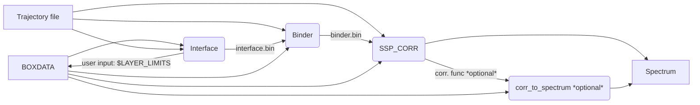
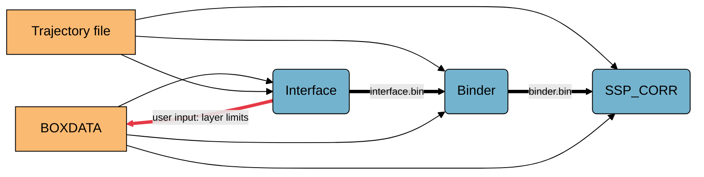
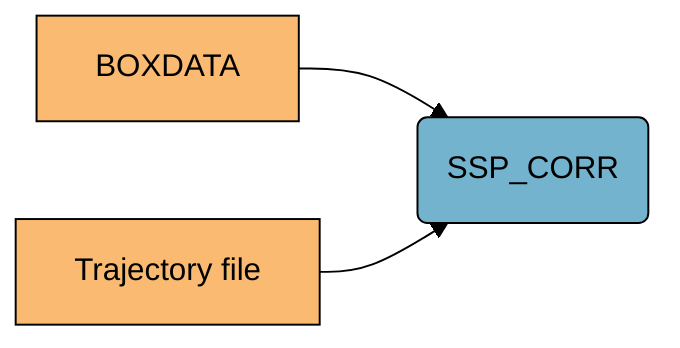

# Program call order



The flowchart above might not be descriptive enough, therefore verbal description of the workflow is provided below.

## Processing a water spectrum

1. User must prepare the [trajectory](../user_guide/files.md/#input-trajectory-files) to be processed and the [BOXDATA file](../user_guide/files.md/#input-boxdata-file).
> [!NOTE]
> The trajectory files should contain only water molecules in the atom order: m[O H1 H2], where m denotes number of water molecules.

2. [Interface program](../programs_description/Interface.md) is called first.
> [!IMPORTANT]
> [interface.bin](../user_guide/files.md/#interfacebin) file will be generated, and it is necessary to approach to the next step.

> [!IMPORTANT]
> [$LAYERS_LIMITS](../user_guide/files.md/#table-of-all-boxdata-file-parameters) should be filled in [the BOXDATA file](../user_guide/files.md/#input-boxdata-file) in accordance to the [density profile](./files.md/#densitydat) to ensure proper run of the next program.

3. [Binder program](../programs_description/Binder.md) is called.
> [!IMPORTANT]
> [binder.bin](../user_guide/files.md/#binderbin) file generated is necessary to approach to the next step.

4. [SSP_CORR program](../programs_description/SSP_CORR.md) is called
	- Creates the [correlation function file](../user_guide/files.md/#-selftermsdat).
	- Creates the [spectrum files](../user_guide/files.md/#-spectrumdat).
> [!NOTE]
> The spectrum can be reprocessed by [corr_to_spectrum program](../programs_description/corr_to_spectrum.md).

### The minimal water processing workflow


The example tajectory can be found on Zenodo: [](https://doi.org/10.5281/zenodo.17588666) as water/water.trr, complementary water/water.gro is present too. The configuration [BOXDATA file](/documenation/user_guide/files.md/#input-boxdata-file) is also present as water/BOXDATA.

1. Go to the downloaded example water/ folder
```bash
cd water/
```

2. [Interface program](/programs_description/Interface.md) is called first.
```bash
Interface.x -i water.trr water.gro --nocheck
```

3. Fill in the [$LAYERS_LIMITS](../user_guide/files.md/#table-of-all-boxdata-file-parameters)
> [!IMPORTANT]
> [$LAYERS_LIMITS](../user_guide/files.md/#table-of-all-boxdata-file-parameters) should be filled in [the BOXDATA file](../user_guide/files.md/#input-boxdata-file) in accordance to the [density profile](./files.md/#densitydat) to ensure proper run of the next program.

> [!NOTE]
> The [$LAYERS_LIMITS](../user_guide/files.md/#table-of-all-boxdata-file-parameters) are already prefilled in the example [BOXDATA FILE](/examples/water/BOXDATA)

3. [Binder program](../programs_description/Binder.md) is called next.
```bash
Binder.x -i water.trr water.gro --nocheck
```
> [!NOTE]
> You can add the -dipole and -hbhist options to enable additional analysis
```bash
Binder.x -i water.trr water.gro --nocheck -dipole -hbhist
```

4. Finally [SSP_CORR program](../programs_description/SSP_CORR.md) is called to obtain the spectrum
```bash
SSP_CORR.x -i water.trr water.gro -L bot BIL -self -good -o BIL
```
A file called BIL-self-shiftedpsectrum.dat containing the spectrum should emerge

## Processing surface hydroxyl contribution

In case of surface hydroxyl processing most of the steps are skipped:

1. User must prepare the [trajectory](../user_guide/files.md/#input-trajectory-files) to be processed 
> [!NOTE]
> The trajectory should contain only the surface hydroxyl atoms in order of: m[metal n[O H]], m denotes number of hydroxyl groups, n denotes to the number of OH groups connected to the metal in the hydroxyl group.

and the [BOXDATA file](../user_guide/files.md/#input-boxdata-file)
> [!IMPORTANT]
> Parameter [$HYDROXYL_METAL](../user_guide/files.md/#table-of-all-boxdata-file-parameters) should be properly specified there.

2. [SSP_CORR program](../programs_description/SSP_CORR.md) is called
	- Creates the [correlation function file](../user_guide/files.md/#-selftermsdat).
	- Creates the [spectrum files](../user_guide/files.md/#-spectrumdat).
> [!NOTE]
> The spectrum can be reprocessed by [corr_to_spectrum program](../programs_description/corr_to_spectrum.md).

### The minimal surface hydroxyl workflow



The example tajectory can be found on Zenodo: [](https://doi.org/10.5281/zenodo.17588666) as hydroxyls/hydroxyls.gro. The configuration [BOXDATA file](/documenation/user_guide/files.md/#input-boxdata-file) is also present as hydroxyls/BOXDATA.

1. Go to the downloaded hydroxyls/ example folder
```bash
cd hydroxyls/
```

3. Make sure that [$HYDROXYL_METAL](../user_guide/files.md/#table-of-all-boxdata-file-parameters) parameter is set properly
> [!NOTE]
> The [$HYDROXYL_METAL](../user_guide/files.md/#table-of-all-boxdata-file-parameters) is already prefilled in the example [BOXDATA FILE](/examples/hydroxyls/BOXDATA)

4. Finally [SSP_CORR program](../programs_description/SSP_CORR.md) is called to obtain the spectrum
```bash
SSP_CORR.x -i water.trr water.gro -good -o HX
```

A file called HX-hydroxyl-shiftedpsectrum.dat containing the spectrum should emerge
